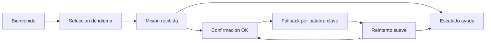

# Ligilo - Handoff para Figma

Este workspace no tiene integracion directa con Figma, asi que el entregable queda especificado para reconstruir el prototipo con fidelidad en Figma y enlazarlo como flujo navegable.

## Paginas del archivo

1. `00 Cover`
2. `01 Telegram Bot Flow`
3. `02 Leader Dashboard`
4. `03 Tokens y componentes`
5. `04 Recovery states`

## Frames sugeridos

### Telegram Bot Flow

- Frame base: `390 x 844`
- Grid: `4 columnas`, margen `20`, gutter `16`
- Safe zone inferior: `32 px`
- Estados a prototipar:
  - `Bot / 01 Bienvenida`
  - `Bot / 02 Seleccion idioma`
  - `Bot / 03 Mision recibida`
  - `Bot / 04 Confirmacion fallback`
  - `Bot / 05 Reintento por baja cobertura`
  - `Bot / 06 Ayuda humana`

### Leader Dashboard

- Frame base desktop: `1440 x 1080`
- Contenedor central maximo: `1600 px`
- Sidebar fija: `320 px`
- Main content con tarjetas de `24 px` de padding y `24 px` de gap

## Flujo del bot

## Componentes a crear en Figma

1. `Bubble / Bot`
   - Fondo: `#FFFFFF`
   - Radio: `24`
   - Sombra suave: `0 6 20 / 8%`
2. `Bubble / User`
   - Fondo: `#26413c`
   - Texto: `#f8f4ea`
3. `Button / Primary`
   - Fondo: `#26413c`
   - Alto minimo: `48`
   - Radio: `16`
4. `Button / Secondary`
   - Fondo: `#FFFFFF`
   - Borde: `1 px #6a4a3c`
5. `Card / Dashboard`
   - Fondo: `rgba(255,255,255,0.85)`
   - Radio: `32`
   - Sombra: `0 14 36 / 12%`

## Tokens visuales

- `pine`: `#26413c`
- `moss`: `#56704f`
- `bark`: `#6a4a3c`
- `ember`: `#b26836`
- `canvas`: `#efe6d2`
- `fog`: `#f8f4ea`
- `sage`: `#c5cfb7`
- Tipografia: `Iowan Old Style` o alternativa serif editorial equivalente
- Direccion visual: cuaderno de campamento, papel tibio, contrastes de tierra, detalles inspirados en cuerda y cartografia ligera

## Copy de referencia

### Estado 01 - Bienvenida

"Bienvenido, scout. Te acompanare para prepararte rapido antes de salir. Necesitaremos menos de un minuto."

CTA: `Empezar`

### Estado 02 - Idioma

"Elige tu idioma. Puedes cambiarlo mas tarde desde el panel del lider."

Opciones (15 idiomas soportados — ES, EN, PT, TH, KO, JA, FR, ZH, HI, AR, DE, RU, PL, UK, IT):

- `Espanol`
- `English`
- `Portugues`
- `Thai`
- `Coreano`
- `Japones`
- `Frances`
- `Chino mandarin`
- `Hindi`
- `Arabe`
- `Aleman`
- `Ruso`
- `Polaco`
- `Ucraniano`
- `Italiano`

Nota de UI:

- Mantener lista vertical con scroll ligero y targets tactiles de al menos `48 px` de alto.

### Estado 03 - Mision

"Tu mision de hoy: llega al punto seguro Faro, valida orientacion y responde antes de las 18:30."

Acciones:

- `Recibida`
- `Necesito ayuda`

### Estado 04 - Confirmacion

"Si la conexion cae, responde con una sola palabra: LISTO, AYUDA o REINTENTO."

### Estado 05 - Reintento

"No llego tu confirmacion. Puede ser un corte breve de red. Pulsa REINTENTAR o responde con la palabra REINTENTO."

Acciones:

- `Reintentar`
- `Enviar SMS interno`

### Estado 06 - Ayuda humana

"Tu lider ya recibio tu alerta con patrulla, hora y ultima accion registrada."

Accion:

- `Compartir ubicacion segura`

## Archivos HTML de referencia en este repo

- `prototype/telegram-bot-flow.html`
- `prototype/leader-dashboard.html`

## Templates Django agregados

- `templates/ligilo/base.html`
- `templates/ligilo/leader_dashboard.html`
- `templates/ligilo/includes/leader_sidebar.html`
- `templates/ligilo/includes/leader_stats.html`
- `templates/ligilo/includes/leader_funnel.html`
- `templates/ligilo/includes/leader_tasks.html`
- `templates/ligilo/includes/leader_coverage.html`
- `prototype/mock_dashboard_context.json`

Estos archivos pueden abrirse en navegador y usarse como base visual para maquetar los frames en Figma.
